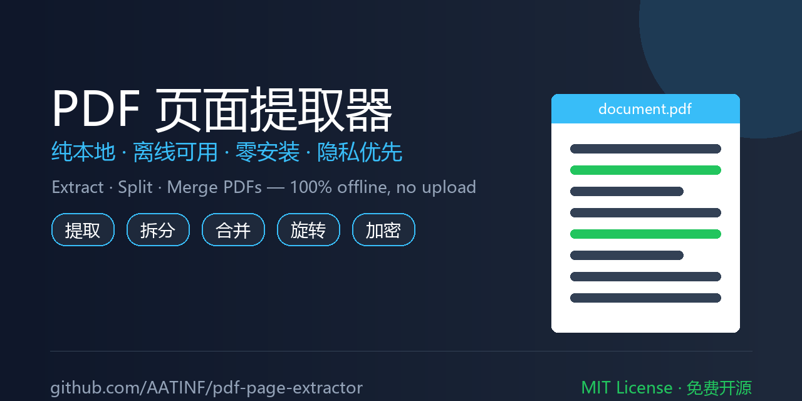
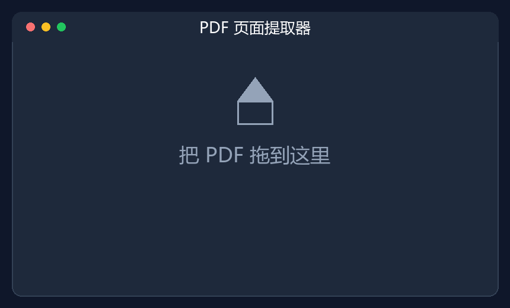
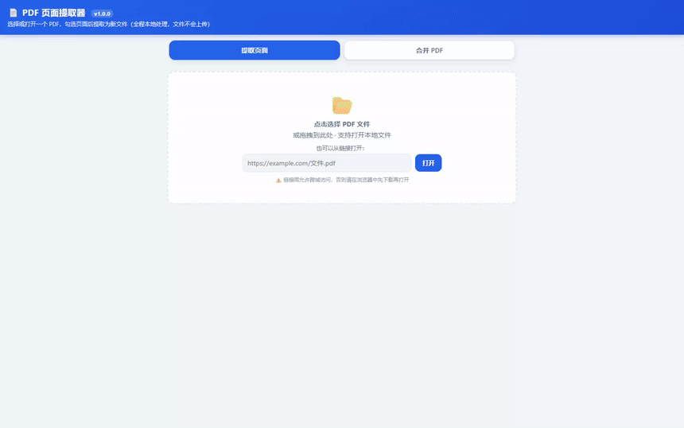
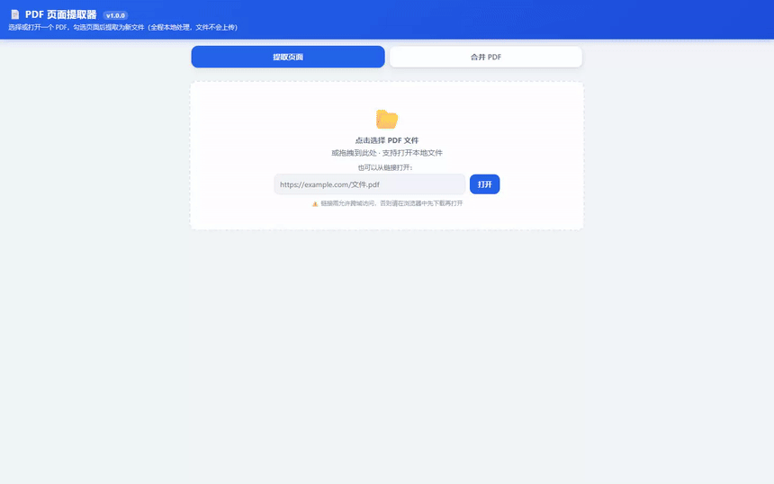
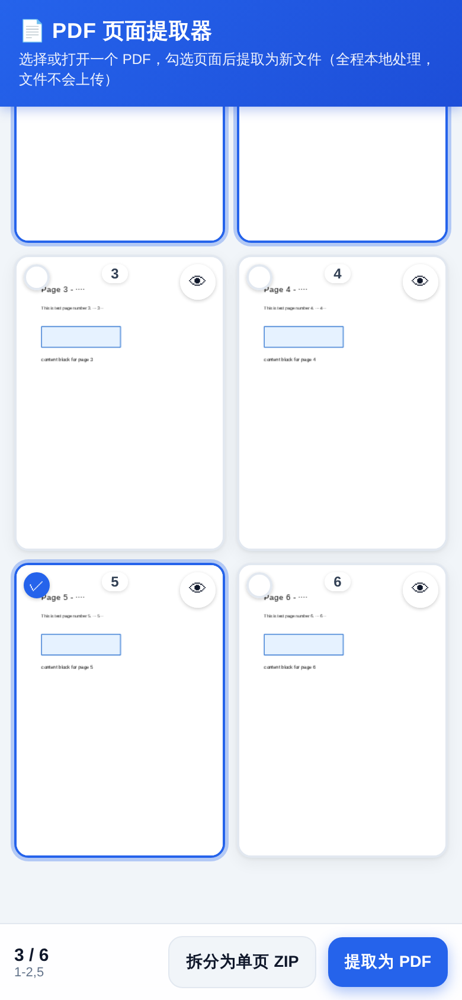

<!-- Hero -->

# 📄 PDF 页面提取器

### 免安装 · 纯前端 · 离线可用 · 隐私优先
在浏览器里选页、提取、拆分、合并 PDF，**文件全程不离开你的设备**。

 

&nbsp;

&nbsp;

---

## ✨ 功能一览（完整 9 大模块）

| 模块 | 功能 | 说明 |
|---|---|---|
| **📂 文档载入** | 文件选择 / 拖拽 / URL 打开 | 支持三种方式载入 PDF；加密文档自动弹出密码框 |
| **👁 缩略图浏览** | 全文档缩略图网格 | 逐页渲染，点击卡片即可勾选，眼睛图标进入预览 |
| **☑ 页面选择** | 点选 / 范围输入 / 组合页码 / 全选·反选 | 支持 `2-5`、`1-3,5,8-10` 等格式批量添加 |
| **🔍 全屏预览** | 单页大图 + 缩放 + 旋转 + 翻页 | 0.4x~4x 缩放、90°旋转、左右滑动切换页面 |
| **📑 提取为 PDF** | 所选页面 → 新 PDF | 普通文档保留矢量文字；加密文档自动转图片 |
| **✂️ 拆分为单页 ZIP** | 每页独立 PDF → 打包下载 | 一键拆分，每页单独文件 |
| **🧩 合并 PDF** | 多文档按序合并为一 | 可多选添加、拖动排序、移除文件 |
| **🔒 加密处理** | 密码打开 + 图片化输出 | 输入密码后正常使用；提取时自动转为图片（清晰度可选） |
| **⚙️ 高级设置** | 旋转 / 倒序 / 清晰度 / 格式 | 选中页追加 90° 旋转、倒序输出、普通/高清、JPEG/PNG |

---

## 🎬 实机演示（真实 Edge 浏览器录制）

> 所有演示均为**真实浏览器操作录屏**，非动画示意。文件从未离开本机。

### ① 提取指定页面

加载 PDF → 渲染缩略图 → 勾选第 2、4 页 → 点击「提取为 PDF」→ 浏览器自动下载。

  
   <a href="assets/demo.mp4">📹 高清 MP4 版</a>

### ② 拆分为单页 ZIP

全选所有页面 → 点击「拆分为单页 ZIP」→ 下载包含每页独立 PDF 的压缩包。

  
   <a href="assets/demo2_split.mp4">📹 高清 MP4 版</a>

### ③ 合并多个 PDF

切换到「合并 PDF」标签 → 添加两份文档 → 调整顺序 → 点击「合并」→ 下载合并结果。

  
   <a href="assets/demo3_merge.mp4">📹 高清 MP4 版</a>

### ④ 全屏预览 + 缩放 + 旋转

点击眼睛图标进入预览 → 放大查看细节 → 旋转页面确认方向 → 关闭返回。

  
   <a href="assets/demo4_preview.mp4">📹 高清 MP4 版</a>

### ⑤ 批量选择（范围 + 页码 + 反选）

输入范围 `1-3` 批量添加 → 输入组合页码 `1,3` → 反选快速翻转选择。

  
   <a href="assets/demo5_select.mp4">📹 高清 MP4 版</a>

---

## 🖼️ 界面截图

  

---

## 🚀 快速开始

| 方式 | 适用场景 | 做法 |
|---|---|---|
| **单文件版（推荐）** | 一切场景 | 下载 `pdf-page-extractor.html`，浏览器打开即用 |
| 多文件版 | 想当 App / PWA | 用浏览器打开 `index.html`（需经服务器） |
| 局域网 | 手机访问电脑 | `python3 serve.py`，手机打开打印出的地址 |

> 💡 **下载即用**：[点此下载单文件版 HTML](https://github.com/AATINF/pdf-page-extractor/releases/latest/download/pdf-page-extractor.html)，双击就能用，**无需安装、无需联网**。

---

## 🔐 为何比在线工具更安全？

市面上的 ilovepdf、smallpdf 等"在线 PDF 工具"**需要把你的文件上传到对方服务器**才能处理——合同、简历、证件扫描件都存在泄露风险。

本工具**完全运行在你的浏览器本地**，所有解析、提取、合并都在本机完成，**任何文件都不会上传到任何服务器**。断网也能用。

| 对比项 | 在线工具（ilovepdf / smallpdf 等） | **本工具（PDF 页面提取器）** |
|---|---|---|
| 文件是否上传 | ❌ 必须上传到第三方服务器 | ✅ **永不离开本机** |
| 是否需要联网 | ❌ 必须 | ✅ 离线可用 |
| 是否需要安装 | 无需（但依赖网络） | ✅ 单文件，双击即用 |
| 隐私风险 | 高（文件经他人服务器） | ✅ 极低（纯本地处理） |
| 大文件 / 敏感文件 | 不建议 | ✅ 适合 |
| 费用 | 多限免费次数 / 付费 | ✅ 完全免费、开源 |

---

## 📖 文档

- 📘 [使用教程（图文 HTML）](教程.html) —— 面向普通用户的全流程教程
- 📗 [详细使用说明](README-使用说明.md)
- 🛠 [开发指南 / 代码复刻](开发指南.md) —— 面向开发者
- 🌐 [English README](README.en.md)
- 📢 [推广文案（中英各平台）](PROMOTION.md)

---

## 🧱 技术架构

纯前端、浏览器本地处理，无后端：

- **PDF.js**（Apache-2.0）：解析 / 渲染 / 缩略图 / 图片化输出
- **pdf-lib**（MIT）：页面复制 / 旋转 / 生成（矢量路径）
- **JSZip**（MIT）：单页拆分打包

第三方库的版权声明保留在 `lib/` 文件头部，重分发请勿删除。

---

## 🔮 未来规划

- [ ] DeepSeek Harness 插件：将核心 PDF 处理能力封装为 DSH 工具插件/MCP Server
- [ ] 应用内英文 UI 切换
- [ ] CI 自动构建 Release（打 tag 即出单文件版）
- [ ] GitHub Pages 在线试用镜像

---

## 📄 License

[MIT License](LICENSE) © 2026 AATINF
